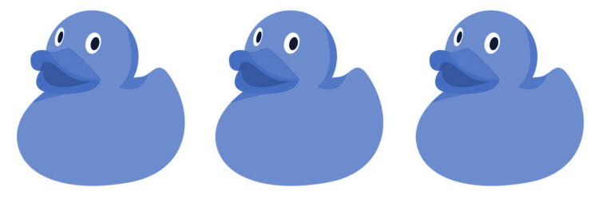

<div align="center" markdown="1">


<br/>


**Redux middleware to dispatch actions via bluetooth to a peripheral store**

[](https://travis-ci.org/jvallelunga/redux-bluetooth)
[](https://codecov.io/gh/jvallelunga/redux-bluetooth)


</div>

Redux Bluetooth is a project which consists in two components: **webapp** middleware, is a redux middleware to dispatch actions via [web bluetooth](https://developers.google.com/web/updates/2015/07/interact-with-ble-devices-on-the-web#user_gesture_required). **peripheral** store, is a redux store which process actions received over bluetooth and notify changes on every store change. 

## Install

```shell
$ npm install redux-bluetooth
```

## Usage

### Webapp

```javascript
import { createSyncStore } from 'redux-bluetooth/build/webapp';

// ACTIONS, list of actions types to dispatch over bluetooth
const store = createSyncStore(ACTIONS);
```

```javascript
import { connect } from 'react-redux';
import { actions } from 'redux-bluetooth/build/webapp';

import Component from './component';

const mapState = state => state;

const mapAction = {
  onConnect: actions.connectStore,
};

export { Component };
export default connect(mapState, mapAction)(Component);
```
**Warning:** actions.connectStore must be trigger by an user action. [more info](https://developers.google.com/web/updates/2015/07/interact-with-ble-devices-on-the-web#user_gesture_required)

### Peripheral
```javascript
import { connectSyncStore } from 'redux-bluetooth/build/peripheral';

// NAME, name of the peripehral
// STORE, redux store
connectSyncStore(NAME, STORE);
```


## Example

### Set up
First, clone this repo and install example dependencies

```shell
$ git clone git@github.com:jvallelunga/redux-bluetooth.git
$ cd redux-bluetooth
$ npm run example:install
```

### Start Peripheral
Make sure you have your bluetooth enabled

```shell
$ npm run example:start
```

### Open Webapp
Before starting the webapp, go to `chrome://flags/#enable-experimental-web-platform-features`, enable the highlighted flag, and restart Chrome on your mobile.

Then, Make sure you have your bluetooth enabled.

Finally, open this url https://jvallelunga.github.io/redux-bluetooth/ on your mobile. 

